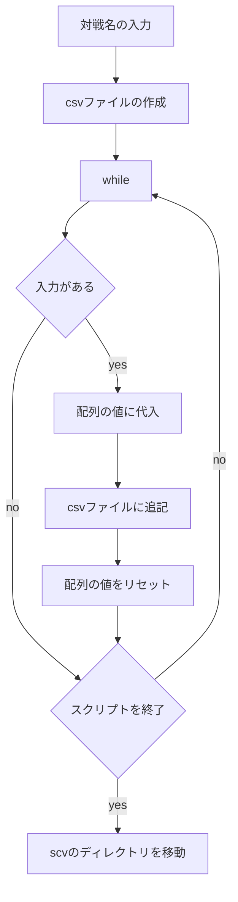

```mermaid
flowchart TD
  A[対戦名の入力] --> B[csvファイルの作成]
  B --> C[while]
  C --> D{入力がある}
  D --> |yes| E[配列の値に代入]
  D --> |no| H{スクリプトを終了}
  E --> F[csvファイルに追記]
  F --> G[配列の値をリセット]
  G --> H
  H --> |yes| I[scvのディレクトリを移動]
  H --> |no| C


```